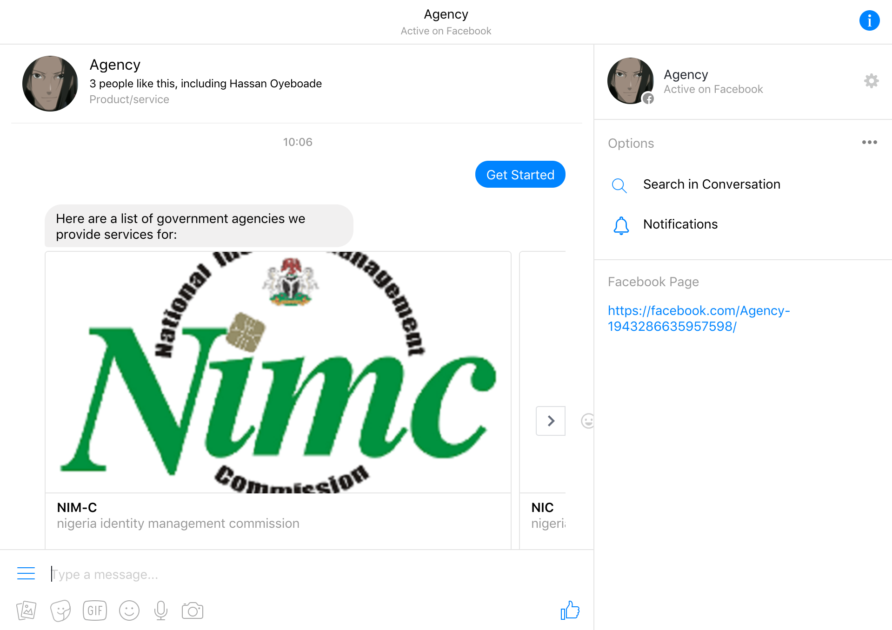

# Agency
> A government services bot.

This bot is built to work with the Facebook messenger platform. It helps users quickly and easily get information about government services.



## Technologies
+ [python 2.7](https://www.python.org/download/releases/2.7/)
+ [Django 1.11](https://www.djangoproject.com/)
+ [MongoDB](https://www.mongodb.com/)
+ [Wit.ai](https://wit.ai/)

## Pre-requisites
+ Python 2.7
+ Virtualenv

## Installation

1. Clone the repo

```sh
$ git clone https://github.com/fb-millionaires/agency.git
```

2. Navigate to the root folder

```sh
$ cd agency
```

3. Create virtual environment (you should have [virtualenv setup](https://virtualenv.pypa.io/en/stable/installation/))

4. Install dependencies.

```sh
$ pip install -r requirements.txt
```


## Run locally
To run locally, you need to set up an app on the Facebook messenger platform. Follow the instructions [here](https://blog.hartleybrody.com/fb-messenger-bot/) to set this up. You should also have [ngrok](https://ngrok.com/) installed.

1. Start up the server

```sh
$ python app.py
```

2. Start up ngrok with any port number of your choice

```sh
$ ./ngrok http 5000
```

## License
Distributed under the MIT license.

## Demo
Visit https://facebook.com/Agency-1943286635957598/ to chat with the bot.